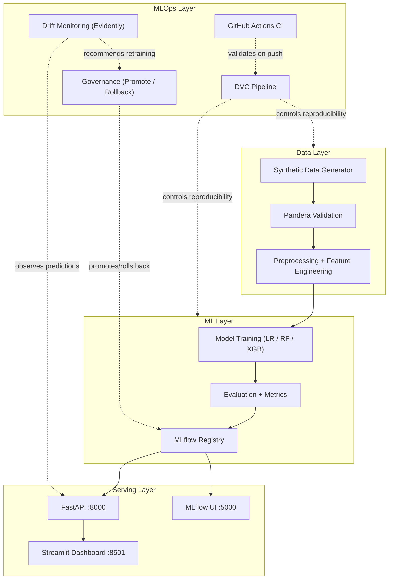
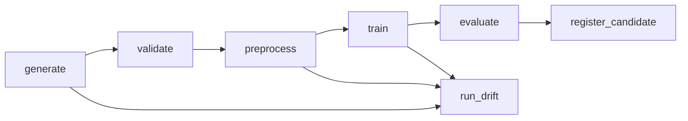
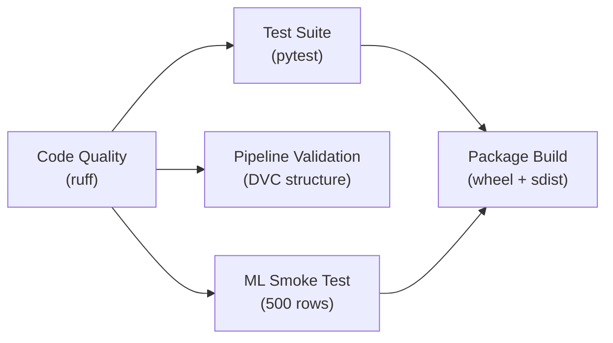
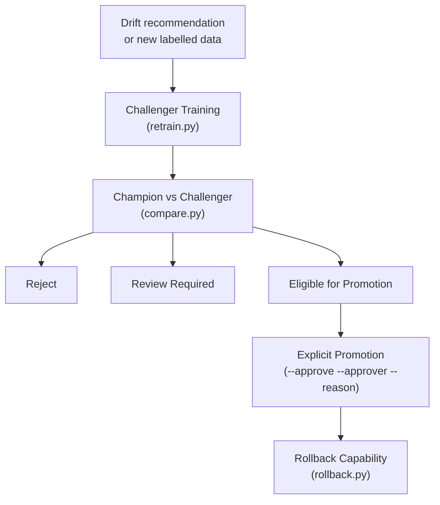

# Oceanographic: A Machine Learning-Driven Sonar Framework for Real-Time Coral Reef Habitat Prediction and Marine Ecosystem Monitoring

**End-to-end MLOps research prototype for coral reef health and restoration-suitability classification using synthetic sonar and environmental sensor data.**


> **Synthetic Data Only** — All observations in this project are computer-generated.
> Predictions do **not** represent real conservation advice and must not be used
> to guide actual marine management decisions.

---

## Table of Contents

1. [Project Overview](#project-overview)
2. [Key Capabilities](#key-capabilities)
3. [Current Project Status](#current-project-status)
4. [System Architecture](#system-architecture)
5. [MLOps Lifecycle](#mlops-lifecycle)
6. [Reproducible DVC Pipeline](#reproducible-dvc-pipeline)
7. [Dataset Description](#dataset-description)
8. [Machine-Learning Tasks](#machine-learning-tasks)
9. [Model Performance](#model-performance)
10. [MLflow Experiment Tracking and Registry](#mlflow-experiment-tracking-and-registry)
11. [API Service](#api-service)
12. [Streamlit Dashboard](#streamlit-dashboard)
13. [Local Setup](#local-setup)
14. [Running the Complete Application](#running-the-complete-application)
15. [Deployment Architecture](#deployment-architecture)
16. [Testing and Code Quality](#testing-and-code-quality)
17. [CI/CD Architecture](#cicd-architecture)
18. [Monitoring and Drift](#monitoring-and-drift)
19. [Model Governance](#model-governance)
20. [Project Structure](#project-structure)
21. [Technology Stack](#technology-stack)
22. [Limitations](#limitations)
23. [Future Work](#future-work)
24. [Responsible-Use Notice](#responsible-use-notice)
25. [Documentation](#documentation)
26. [License](#license)
27. [Attribution](#attribution)

---

## Project Overview

Coral reef ecosystems face accelerating degradation from ocean warming, acidification, and pollution. Monitoring reef health at scale requires integrating data from sonar instruments, environmental sensors, and biological surveys — then translating that data into actionable classification decisions.

**Oceanographic** is an MLOps-based research and classroom prototype that demonstrates how such a system could be built from scratch. It implements two supervised classification tasks — reef health assessment and restoration-suitability scoring — within a fully reproducible machine-learning pipeline, governed model registry, inference service, interactive dashboard, and containerised deployment stack.

**Current prototype scope:** The system operates entirely on a **synthetic dataset of 15,000 observations** generated by a documented statistical model. Synthetic sonar and environmental sensor records are used to demonstrate the software and MLOps workflow because verified field equipment and expert-labelled real-world data are not currently available. No predictions from this system have been validated by marine scientists or used for real restoration decisions.

---

## Key Capabilities

- **Sonar and environmental feature processing** — 15 numeric features (acoustic backscatter, rugosity, depth, temperature, pH, dissolved oxygen, turbidity, and more) plus one categorical region feature, with 6 engineered derived features
- **Reef health classification** — Four-class classification: healthy, stressed, bleached, severely degraded
- **Restoration-suitability classification** — Three-class classification: suitable, moderately suitable, unsuitable
- **Schema validation** — Pandera-based data contract enforcement on raw observations
- **Reproducible preprocessing** — Stratified train/test split, StandardScaler + OneHotEncoder pipeline, fitted on training data only
- **Model comparison** — Logistic Regression, Random Forest, and XGBoost evaluated via 5-fold cross-validation
- **MLflow experiment tracking and registry** — All runs logged with parameters, metrics, and artifacts; champion/candidate versioning with manual promotion
- **DVC pipeline** — Seven-stage reproducible DAG with parameterised dependencies and cached stages
- **FastAPI inference** — Seven REST endpoints with Pydantic validation, batch support, and graceful degradation
- **Streamlit dashboard** — Ten-page interactive dashboard with reef maps, predictions, model performance, drift monitoring, and governance views
- **Drift monitoring** — Evidently feature drift, chi-squared prediction drift, and KS confidence drift on simulated production windows
- **Controlled retraining and governance** — Challenger training, champion comparison, explicit approval-gated promotion, and auditable rollback
- **Docker orchestration** — Four-service Compose stack (MLflow, API, Dashboard, Drift) with health checks and read-only canonical database
- **GitHub Actions CI** — Five-job pipeline: code quality, test suite, pipeline validation, ML smoke test, package build

---

## Current Project Status

| Category | Status | Notes |
|----------|--------|-------|
| Synthetic data generator | Implemented | 15,000 observations, 4 Indian reef regions, seed-reproducible |
| Schema validation | Implemented | Pandera contract on all 21 columns |
| Feature engineering | Implemented | 6 derived features (thermal stress, oxygen stress, acidity deviation, water quality index, substrate stability, structural complexity) |
| Model training and selection | Implemented | 3 algorithms x 2 tasks, 5-fold CV, MLflow-tracked |
| MLflow registry | Implemented | Champion v1 models registered and aliased |
| DVC pipeline | Implemented | 7 stages, fully reproducible |
| FastAPI inference | Implemented | 7 endpoints, bundle and registry loading modes |
| Streamlit dashboard | Implemented | 10 pages including reef map and live predictions |
| Drift monitoring | Implemented | Simulated production windows with configurable shift scale |
| Controlled retraining | Implemented | Challenger training, comparison, gated promotion, rollback |
| Docker deployment | Implemented | 4-service local Compose stack |
| CI/CD pipeline | Implemented | 5 GitHub Actions jobs on every push/PR |
| Real sonar integration | Not yet implemented | Requires field equipment and calibration |
| Marine-scientist validation | Not yet performed | Synthetic data only; no ecological conclusions |
| Cloud deployment | Not yet implemented | Local prototype only |

---

## System Architecture



---

## MLOps Lifecycle

1. **Data preparation** — `src/data/generate_data.py` produces 15,000 synthetic observations from documented statistical rules with a fixed random seed
2. **Validation** — `src/data/validate.py` enforces a Pandera schema on all columns (types, ranges, allowed categories)
3. **Feature engineering** — `src/features/build_features.py` computes 6 derived features; `src/data/preprocess.py` performs a stratified 80/20 split and fits a `ColumnTransformer` on the training set only
4. **Training** — `src/models/train.py` trains Logistic Regression, Random Forest, and XGBoost for both tasks with 5-fold cross-validation; selects the best model by CV macro-F1
5. **Evaluation** — `src/models/evaluate.py` computes test-set metrics, confusion matrices, and per-class reports; `src/models/run_evaluate.py` extracts summary metrics into `reports/metrics.json`
6. **Experiment tracking** — All training runs are logged to MLflow (parameters, metrics, artifacts, model signatures)
7. **Registration** — `src/models/run_register_candidate.py` registers the best model as a candidate version; champion promotion is a separate governed step
8. **Deployment** — FastAPI serves champion models via bundle-mode (checksum-verified joblib artefacts) or registry-mode (MLflow client)
9. **Monitoring** — Evidently feature drift, chi-squared prediction drift, and Kolmogorov-Smirnov confidence drift computed against a reference window
10. **Controlled retraining** — `src/models/retrain.py` validates labelled input, trains challengers, and registers them without promotion; `src/models/compare.py` evaluates against the champion; `src/models/promote.py` requires explicit `--approve`, `--approver`, and `--reason` flags

---

## Reproducible DVC Pipeline

The pipeline is defined in `dvc.yaml` with seven stages. All parameters are sourced from `params.yaml`.



The `run_drift` stage depends on raw data (from `generate`), preprocessors (from `preprocess`), and trained models (from `train`). It runs in parallel with the `evaluate` → `register_candidate` chain.

**Useful commands:**

| Command | Description |
|---------|-------------|
| `dvc status` | Show which stages are stale |
| `dvc dag` | Display the pipeline DAG |
| `dvc repro --dry` | Preview what would run without executing |
| `dvc metrics show` | Display tracked metrics |
| `dvc params diff` | Show parameter changes since last run |

**Important:** Running `dvc repro` will execute the full pipeline, which trains models and registers candidate versions. Candidate registration **never** automatically promotes the champion — promotion is always an explicit governance step.

---

## Dataset Description

The dataset contains **15,000 synthetic observations** split into 12,000 training and 3,000 test observations (stratified 80/20 split). All observations are generated by `src/data/generate_data.py` with `random_seed=42` for full reproducibility.

Four Indian reef regions are covered: Lakshadweep, Gulf of Mannar, Gulf of Kutch, and Andaman and Nicobar Islands.

### Feature table

| Category | Feature | Unit | Range | Description |
|----------|---------|------|-------|-------------|
| Spatial | `region` | — | 4 categories | Named reef region |
| Spatial | `latitude`, `longitude` | degrees | per region | WGS-84 coordinates |
| Spatial | `timestamp` | — | 2018–2024 | UTC observation timestamp |
| Environmental | `depth_m` | m | 0–50 | Sensor deployment depth |
| Environmental | `water_temperature_c` | °C | 10–42 | In-situ water temperature |
| Environmental | `ph` | — | 7.0–9.0 | Seawater pH (total scale) |
| Environmental | `salinity_ppt` | ppt | 20–50 | Practical salinity |
| Environmental | `dissolved_oxygen_mg_l` | mg/L | 0–15 | Dissolved oxygen |
| Environmental | `turbidity_ntu` | NTU | 0–100 | Water turbidity |
| Environmental | `light_intensity` | umol m-2 s-1 | 0–3000 | Photosynthetically active radiation |
| Environmental | `current_speed_m_s` | m/s | 0–5 | Near-bottom current speed |
| Sonar / Acoustic | `sonar_backscatter` | dB | -60 to 0 | Acoustic backscatter intensity |
| Sonar / Acoustic | `rugosity_index` | — | 1–10 | Benthic surface rugosity |
| Sonar / Acoustic | `hard_substrate_percentage` | % | 0–100 | Hard substrate coverage |
| Sonar / Acoustic | `acoustic_complexity_index` | — | 0–1 | Normalised acoustic complexity |
| Biological | `coral_cover_percentage` | % | 0–100 | Live coral cover |
| Biological | `bleaching_percentage` | % | 0–100 | Bleached coral tissue fraction |
| Biological | `disease_percentage` | % | 0–100 | Disease-affected colony fraction |
| **Target** | `reef_health` | — | 4 classes | healthy, stressed, bleached, severely_degraded |
| **Target** | `restoration_suitability` | — | 3 classes | suitable, moderately_suitable, unsuitable |

Six derived features are computed during preprocessing: `thermal_stress_index`, `oxygen_stress_index`, `acidity_deviation`, `water_quality_index`, `substrate_stability_score`, and `structural_complexity_score`.

**Synthetic-data limitations:** All feature distributions, correlations, and label thresholds are approximations. The data does not model temporal autocorrelation, fine-scale spatial gradients, or non-Gaussian instrument noise. See [`docs/data_dictionary.md`](docs/data_dictionary.md) for full documentation.

---

## Machine-Learning Tasks

| Property | Reef Health | Restoration Suitability |
|----------|-------------|-------------------------|
| Target column | `reef_health` | `restoration_suitability` |
| Number of classes | 4 | 3 |
| Candidate algorithms | Logistic Regression, Random Forest, XGBoost | Logistic Regression, Random Forest, XGBoost |
| Selected champion | **Logistic Regression** | **XGBoost** |
| Selection metric | CV macro-F1 (5-fold) | CV macro-F1 (5-fold) |
| CV folds | 5 | 5 |
| Class weighting | Balanced | Balanced (LR, RF) |

---

## Model Performance

Metrics from `models/evaluation_health.json` and `models/evaluation_restoration.json`.

### Reef Health — Champion: Logistic Regression

| Metric | Value |
|--------|-------|
| CV macro-F1 | 0.7612 |
| CV balanced accuracy | 0.7776 |
| Test macro-F1 | **0.7871** |
| Test balanced accuracy | 0.8012 |
| Test accuracy | 0.8193 |

| Class | Precision | Recall | F1 | Support |
|-------|-----------|--------|----|---------|
| healthy | 0.66 | 0.74 | 0.70 | 318 |
| stressed | 0.94 | 0.86 | 0.90 | 1,726 |
| bleached | 0.89 | 0.88 | 0.88 | 283 |
| severely_degraded | 0.63 | 0.72 | 0.67 | 673 |

### Restoration Suitability — Champion: XGBoost

| Metric | Value |
|--------|-------|
| CV macro-F1 | 0.7913 |
| CV balanced accuracy | 0.8016 |
| Test macro-F1 | **0.8029** |
| Test balanced accuracy | 0.8121 |
| Test accuracy | 0.8277 |

| Class | Precision | Recall | F1 | Support |
|-------|-----------|--------|----|---------|
| suitable | 0.71 | 0.73 | 0.72 | 907 |
| moderately_suitable | 0.90 | 0.87 | 0.89 | 1,798 |
| unsuitable | 0.77 | 0.83 | 0.80 | 295 |

> **Disclaimer:** These metrics were obtained using synthetic prototype data and do not measure real-world ecological validity. Quality gates require minimum CV macro-F1 of 0.70 (health) and 0.73 (restoration) for candidate promotion.

---

## MLflow Experiment Tracking and Registry

All training runs are logged to an MLflow SQLite backend (`artifacts/mlruns.db`) with:

- **Parameters:** algorithm hyperparameters, random seed, CV folds, split ratios
- **Metrics:** CV macro-F1, CV balanced accuracy, test accuracy, test F1, per-class precision/recall
- **Artifacts:** serialised model (joblib), evaluation JSON, confusion matrix, feature importance

### Model Registry

| Registered Model | Champion Algorithm | Version | CV macro-F1 | Alias |
|------------------|--------------------|---------|-------------|-------|
| `coralsense_reef_health` | Logistic Regression | 1 | 0.7612 | champion |
| `coralsense_restoration_suitability` | XGBoost | 1 | 0.7913 | champion |

> **Note on legacy identifiers:** The registered model names use the `coralsense_` prefix. This is a legacy internal identifier in the MLflow database and `params.yaml` configuration. The project identity is **Oceanographic**.

### Promotion and Rollback

- **Promotion** requires `--approve`, `--approver`, and `--reason` flags. Automatic promotion is prohibited.
- **Rollback** moves the champion alias to a previous version without deleting any model version.
- Model cards can be generated for any registered version.

### MLflow UI

The MLflow server UI is launched via Docker because the local Python 3.14 environment has an incompatibility with the MLflow server import path.

```bash
make mlflow-ui          # Start on http://127.0.0.1:5000
make mlflow-ui-stop     # Stop the container
```

---

## API Service

The FastAPI inference service (`src/api/main.py`) exposes both champion models over HTTP.

### Launch

```bash
uvicorn src.api.main:app --host 127.0.0.1 --port 8000
```

API documentation: http://127.0.0.1:8000/docs

### Endpoints

| Method | Path | Description |
|--------|------|-------------|
| `GET` | `/` | Project index and documentation links |
| `GET` | `/health` | Process liveness — always `200` while serving |
| `GET` | `/ready` | Deployment readiness — `200` only when both champions are loaded, otherwise `503` |
| `GET` | `/model-info` | Champion model metadata (safe fields only) |
| `POST` | `/predict/reef-health` | Single reef-health prediction |
| `POST` | `/predict/restoration` | Single restoration-suitability prediction |
| `POST` | `/predict/both` | Both predictions for one observation |
| `POST` | `/predict/batch` | Batch predictions (max 50 observations) |

#### Liveness versus readiness

The two probes answer different questions and are deliberately allowed to disagree:

| | `/health` | `/ready` |
|---|---|---|
| Question | Is the process alive? | Can it actually serve predictions? |
| Both models loaded | `200`, `status: ok` | `200`, `ready: true` |
| A model failed to load | `200`, `status: degraded` | `503`, `ready: false` |
| Intended consumer | Restart policy | Traffic routing / container health |

`/health` stays `200` when degraded so an orchestrator does not restart a running
instance that is merely missing a model. `/ready` is what gates traffic, and it is
what the API container's Docker health check probes — so a container is "healthy"
only once both champion pipelines have loaded from the checksum-verified bundle.
Neither response contains a filesystem path, MLflow URI, configuration value, or
traceback.

### Example request

```bash
curl -s -X POST http://127.0.0.1:8000/predict/both \
  -H "Content-Type: application/json" \
  -d '{
    "region": "Gulf of Mannar",
    "depth_m": 5.0,
    "water_temperature_c": 27.5,
    "ph": 8.1,
    "salinity_ppt": 35.0,
    "dissolved_oxygen_mg_l": 7.0,
    "turbidity_ntu": 2.0,
    "light_intensity": 800.0,
    "current_speed_m_s": 0.2,
    "sonar_backscatter": -15.0,
    "rugosity_index": 3.5,
    "hard_substrate_percentage": 60.0,
    "acoustic_complexity_index": 0.7,
    "coral_cover_percentage": 45.0,
    "bleaching_percentage": 5.0,
    "disease_percentage": 2.0
  }'
```

### Example response

```json
{
  "health": {
    "predicted_class": "healthy",
    "probabilities": {
      "bleached": 0.000004,
      "healthy": 0.984728,
      "severely_degraded": 0.0,
      "stressed": 0.015268
    },
    "confidence": 0.984728,
    "task": "health",
    "model_alias": "champion",
    "synthetic_data_disclaimer": "Predictions generated by a model trained on synthetic data only. Do not use to guide real-world conservation decisions."
  },
  "restoration": {
    "predicted_class": "suitable",
    "probabilities": {
      "moderately_suitable": 0.008054,
      "suitable": 0.991880,
      "unsuitable": 0.000065
    },
    "confidence": 0.99188,
    "task": "restoration",
    "model_alias": "champion",
    "synthetic_data_disclaimer": "Predictions generated by a model trained on synthetic data only. Do not use to guide real-world conservation decisions."
  }
}
```

### Input validation

All 16 inference features are required with domain-appropriate bounds. The API rejects NaN/Inf values, unknown regions, out-of-range values, and extra fields (including target labels). Invalid requests receive a 422 response with field-level error details. Unavailable models return 503.

---

## Streamlit Dashboard

The interactive dashboard provides ten pages for data exploration, prediction, and MLOps monitoring.

| Page | Description |
|------|-------------|
| Home (`app.py`) | Project overview, champion model cards, synthetic-data disclaimer |
| 1 — Overview | Project objectives, sonar vs environmental feature distinction |
| 2 — Reef Map | Interactive Plotly OpenStreetMap scatter map with region filters |
| 3 — Habitat Health | Health class distribution, box/violin plots, region breakdown |
| 4 — Restoration Planning | Suitability distribution, feature comparisons, top suitable sites |
| 5 — Predict | Sensor input form with live dual-task prediction via the API |
| 6 — Model Performance | Algorithm comparison, CV F1 bar charts, per-class metrics |
| 7 — MLOps Status | Pipeline milestone status, live champion metadata from the API |
| 8 — Drift Monitoring | Feature, prediction, and confidence drift visualisation |
| 9 — Governance | Model governance status and retraining workflow overview |

### Launch

```bash
# Requires the FastAPI service running on port 8000
streamlit run src/dashboard/app.py
```

Dashboard URL: http://localhost:8501

The `CORALSENSE_API_URL` environment variable overrides the API base URL (default: `http://127.0.0.1:8000`).

---

## Local Setup

### Prerequisites

- Python >= 3.11 (tested on 3.12 and 3.14; CI uses 3.12)
- Git
- Docker + Docker Compose (optional, for containerised deployment)

### Installation

```bash
git clone https://github.com/divya-m984/Oceanographic-Coral-reefs-preservation-and-prediction.git
cd Oceanographic-Coral-reefs-preservation-and-prediction

python3 -m venv .venv
source .venv/bin/activate

python -m pip install --upgrade pip
python -m pip install -r requirements.txt
python -m pip install -e .
```

Or use the Makefile shortcut:

```bash
make install
```

Optionally copy the environment template:

```bash
cp .env.example .env
```

### DVC remote access

Versioned pipeline artifacts are stored in the DagsHub-backed DVC remote named `dagshub`. The tracked `.dvc/config` contains only non-secret remote configuration; authentication credentials must remain local in `.dvc/config.local`, which is Git-ignored.

The `dvc[s3]` dependency in `requirements.txt` provides the S3-compatible remote support required by DagsHub.

Set `DAGSHUB_TOKEN` securely in your shell, then configure your credentials locally:

```bash
dvc remote modify --local dagshub access_key_id "$DAGSHUB_TOKEN"
dvc remote modify --local dagshub secret_access_key "$DAGSHUB_TOKEN"
unset DAGSHUB_TOKEN
```

Never commit or share `.dvc/config.local`, access tokens, or other credentials.

Restore the DVC-managed datasets, preprocessors, models, and monitoring artifacts for the current Git revision:

```bash
dvc pull -r dagshub
```

Check synchronization without uploading:

```bash
dvc status --remote dagshub
```

When intentionally publishing newly versioned DVC objects:

```bash
dvc push -r dagshub
```

The read-only preflight (`make preflight`) audits this configuration. Three checks are blocking: `dvc[s3]` must be installed, the tracked `.dvc/config` must declare the `dagshub` remote with the expected URL and endpoint, and no credential fields may have leaked into that tracked config. The `.dvc/config.local` check is blocking only when the file is *unsafe* — tracked by Git or not Git-ignored; a missing `.dvc/config.local` is reported as a warning, since a collaborator may simply not have configured credentials yet. Preflight then runs a time-boxed, read-only `dvc status --remote dagshub`; missing credentials, unreachable network, and unsynchronised objects are reported as warnings, so preflight stays usable offline. Preflight never pushes, pulls, reproduces, or writes credentials, and never prints credential values.

---

## Running the Complete Application

### Native development mode (three terminals)

```bash
# Terminal 1 — MLflow UI (Docker, Python 3.12)
make mlflow-ui

# Terminal 2 — FastAPI inference service
source .venv/bin/activate
uvicorn src.api.main:app --host 127.0.0.1 --port 8000

# Terminal 3 — Streamlit dashboard
source .venv/bin/activate
streamlit run src/dashboard/app.py
```

| Service | URL |
|---------|-----|
| MLflow UI | http://127.0.0.1:5000 |
| API docs | http://127.0.0.1:8000/docs |
| Dashboard | http://localhost:8501 |

### Docker Compose mode

```bash
# 1. Export champion models to deployment bundles (required once)
python scripts/export_champions.py
python scripts/verify_deployment_bundle.py

# 2. Build and start all services
docker compose up --build -d

# 3. Verify
docker compose ps
python scripts/demo.py verify   # submits a test prediction

# 4. Stop
docker compose down

# Optional: run drift monitoring
docker compose --profile drift run --rm drift
```

The `Makefile` also provides demo targets:

```bash
make demo           # preflight + start + verify
make demo-stop      # stop all services
```

---

## Deployment Architecture

Two distinct configurations share the same images.

### Local demonstration stack

Docker Compose, described above. Four services: `mlflow` (tracking UI), `api`,
`dashboard`, and the optional `drift` profile. The dashboard bind-mounts
`data/raw/` and `reports/` from the host so a local `make drift` run shows up
without a rebuild; the canonical `artifacts/mlruns.db` is mounted **read-only**
and is never modified.

### Production serving architecture

Public serving needs neither MLflow nor DVC at runtime:

| Concern | Production behaviour |
|---|---|
| Model loading | `CORALSENSE_MODEL_MODE=bundle` — the API loads the champion pipelines from the checksum-verified bundle baked into the image at `deploy/bundles/`. No registry query, no MLflow connection, no network call. |
| Model/data provenance | A CI release job restores artifacts with `dvc pull`, exports and verifies the champion bundle, then builds the images. Restoration happens **during image construction**, never at container start. |
| Dashboard data | The dashboard image bakes in the read-only synthetic demo assets (`data/raw/observations.csv`, `models/evaluation_*.json`, `reports/drift_summary.json`), so it runs standalone with no bind mount. |
| Dashboard → API | Server-to-server over `CORALSENSE_API_URL`. Set it to the API's full public HTTPS URL; no code change and no browser-side API call is involved. |
| Credentials | Runtime containers hold **no** DagsHub or DVC credentials. `.dvc/`, `.dvc/config.local`, and `.env` are excluded from every build context by an allow-list `.dockerignore`. |
| Listening port | Both images bind `0.0.0.0` on `${PORT}`, falling back to `8000` (API) and `8501` (dashboard). Hosting providers that inject `PORT` are supported without configuration. |
| MLflow | Not required for public serving. It remains a local/CI experiment-tracking tool. |

Planned, **not yet built**: a GitHub Actions release job publishing these images
to GHCR, with Render running the prebuilt images. Render never receives
DagsHub/DVC credentials. Nothing in this project is publicly deployed today.

#### Build contexts

The repository working tree is several hundred megabytes. Each serving image
uses an allow-list build context that denies everything and re-includes only
what that image copies:

| File | Applies to | Admits |
|---|---|---|
| `.dockerignore` | shared baseline (and any non-BuildKit build) | union of all three images' needs |
| `Dockerfile.api.dockerignore` | API (BuildKit) | source, `params.yaml`, packaging, `docker/`, `deploy/bundles/` |
| `Dockerfile.dashboard.dockerignore` | dashboard (BuildKit) | source, packaging, `.streamlit/`, the static demo assets |

BuildKit uses the Dockerfile-specific file *instead of* the root one rather than
merging them, so all three are self-contained. The image-specific files enforce a
separation the shared file cannot: the API context carries no dataset, and the
dashboard context carries no model or bundle. `mlruns/`, `artifacts/`,
`data/processed/`, `models/*.joblib`, `tests/`, `notebooks/`, `.venv/`, and all
secret files stay out of every context.

---

## Testing and Code Quality

```bash
# Run the full test suite (1,000+ tests)
make test
# or
python -m pytest tests/ -q

# Lint
make lint
# or
ruff check src/ tests/ scripts/

# Format check
make format-check
# or
ruff format --check src/ tests/ scripts/

# Run the local CI-equivalent script
make ci-check
# or
bash scripts/ci_check.sh

# Read-only preflight system check
make preflight

# DVC pipeline validation (does not run training)
dvc status
dvc dag
```

---

## CI/CD Architecture

The GitHub Actions workflow (`.github/workflows/ci.yml`) runs five jobs on every push and pull request to `main` or `master`.



| Job | What it does | Timeout |
|-----|--------------|---------|
| Code Quality | `ruff check` + `ruff format --check` | 10 min |
| Test Suite | Full pytest suite with disposable MLflow DB | 30 min |
| Pipeline Validation | `dvc dag`, DVC structure tests, isolated data round-trip | 10 min |
| ML Smoke Test | Quick training on 500 synthetic rows; verifies predictions and metrics | 15 min |
| Package Build | `python -m build`; uploads `dist/` artifact | 10 min |

**What is intentionally excluded from CI:**
- The full DVC pipeline (`dvc repro`)
- Model registration or champion promotion
- The canonical MLflow database (`artifacts/mlruns.db`)
- Automated production deployment

CI uses Python 3.12 and `MLFLOW_TRACKING_URI=sqlite:///ci_mlruns.db` to isolate all runs from the canonical database.

---

## Monitoring and Drift

Drift monitoring uses Evidently and statistical tests to detect distribution shifts between a reference window and a simulated production window.

| Drift Type | Method | Description |
|------------|--------|-------------|
| Feature drift | Evidently `DataDriftPreset` (Wasserstein distance) | Detects shifts in individual feature distributions |
| Prediction drift | Chi-squared test (`chi2_contingency`) | Detects changes in predicted class distributions |
| Confidence drift | Kolmogorov-Smirnov test | Detects changes in model confidence score distributions |

**Current implementation:** The production window is **simulated** by applying controlled synthetic shifts to sampled observations. At the default shift scale (`shift_scale=1.0`), four features exhibit significant drift, and the system recommends retraining.

```bash
# Generate drift report
make drift
# or
python -m src.monitoring.run_drift --no-html

# With different shift intensities
python -m src.monitoring.run_drift --shift-scale 0     # no shift (baseline)
python -m src.monitoring.run_drift --shift-scale 2.0   # stronger shift
```

The drift summary (`reports/drift_summary.json`) includes per-column drift status, prediction distribution changes, confidence deltas, and a retraining recommendation.

---

## Model Governance

Oceanographic enforces a governed model lifecycle. Automatic promotion is prohibited at every stage.



**Key rules:**
- Retraining requires **labelled data** — unlabelled production windows are rejected
- The retraining script registers challengers but **never sets the champion alias**
- Promotion requires `--approve`, `--approver`, and `--reason` flags
- Comparison outcomes: `reject`, `review_required`, or `eligible_for_promotion`
- Rollback moves the champion alias without deleting any model version
- All promotion and rollback actions generate auditable JSON receipts

---

## Project Structure

```
Oceanographic-Coral-reefs-preservation-and-prediction/
├── README.md
├── Makefile                     # Build, test, demo, and service targets
├── CHANGELOG.md                 # Milestone history
├── pyproject.toml               # Build config, pytest, ruff settings
├── requirements.txt             # Full dependency list
├── params.yaml                  # Single source of truth for all parameters
├── dvc.yaml                     # Seven-stage pipeline DAG
├── docker-compose.yml           # Four-service container orchestration
├── Dockerfile.api               # FastAPI multi-stage image
├── Dockerfile.dashboard         # Streamlit multi-stage image
├── Dockerfile.mlflow            # MLflow tracking server image
├── .github/workflows/ci.yml    # GitHub Actions CI pipeline
├── .env.example                 # Environment variable template
├── src/
│   ├── config.py                # Central config (paths, params, logging)
│   ├── data/                    # Data generation, validation, preprocessing
│   ├── features/                # Derived feature engineering
│   ├── models/                  # Training, evaluation, registry, prediction,
│   │                            #   retraining, comparison, promotion, rollback
│   ├── monitoring/              # Drift detection and production simulation
│   ├── api/                     # FastAPI service (schemas, loader, endpoints)
│   └── dashboard/               # Streamlit app and 9 pages
├── data/
│   ├── raw/                     # Generated observations (DVC-tracked)
│   ├── processed/               # Train/test splits and preprocessors
│   ├── reference/               # Drift reference window
│   └── production/              # Simulated production window
├── models/                      # Serialised model and evaluation artifacts
├── artifacts/                   # MLflow SQLite database
├── reports/                     # Metrics, drift summaries, governance receipts
├── scripts/                     # CI, demo, preflight, export, retraining CLIs
├── docker/                      # Container init scripts
├── docs/                        # Architecture, demo guide, data dictionary
└── tests/                       # 1,000+ automated tests
```

---

## Technology Stack

| Category | Technologies |
|----------|-------------|
| ML / Data | Python, NumPy, Pandas, scikit-learn, XGBoost, SciPy, SHAP |
| MLOps | MLflow 3.x, DVC 3.x, Evidently 0.7, Pandera |
| API | FastAPI, Uvicorn, Pydantic v2 |
| Dashboard | Streamlit, Plotly |
| Testing | pytest, ruff |
| Deployment | Docker, Docker Compose |
| CI/CD | GitHub Actions |

---

## Limitations

- **Synthetic dataset** — All 15,000 observations are computer-generated. Feature distributions and label thresholds are approximations, not field-calibrated ecological models.
- **No live sonar hardware integration** — The system does not connect to real sonar instruments, ROVs, AUVs, or buoy sensors.
- **No marine-scientist field validation** — No predictions have been reviewed or validated by domain experts.
- **Credentialed external DVC storage** — Pipeline artifacts are backed by the DagsHub DVC remote, but collaborators require their own DagsHub credentials. CI remains intentionally isolated and does not depend on external `dvc pull` access.
- **Local prototype deployment** — Docker Compose runs on `localhost`; no cloud hosting, TLS, or authentication is configured.
- **Predictions must not be used for real restoration decisions** — This is a research and educational prototype.
- **Legacy identifiers** — MLflow registered model names and some internal paths use the `coralsense_` prefix from an earlier project phase. These are database-level identifiers that persist in `artifacts/mlruns.db` and `params.yaml`.

---

## Future Work

- Real sonar and environmental sensor data ingestion (AUV/ROV or moored buoy telemetry)
- Time-series and spatial modelling (seasonal cycles, reef transect gradients)
- Field validation with expert-labelled datasets from marine biologists
- Production-grade remote-storage hardening with retention policies, backups, lifecycle controls, and least-privilege access
- Secure hosted deployment with TLS, authentication, and role-based access
- Continuous data collection and automated drift monitoring triggers
- Alerting on drift events and model degradation
- Explainability (SHAP dashboards) and uncertainty estimation for predictions
- Integration with reef conservation databases and GIS platforms

---

## Responsible-Use Notice

> **This system is a research and educational prototype.** It is designed to demonstrate MLOps principles and software engineering practices in a marine science context. All data is synthetic. All predictions are generated by models trained on synthetic data. No output from this system should be interpreted as scientific advice, ecological assessment, or guidance for real-world coral reef conservation, restoration planning, or marine management decisions.

---

## Documentation

| Document | Description |
|----------|-------------|
| [`docs/architecture.md`](docs/architecture.md) | Full system architecture |
| [`docs/data_dictionary.md`](docs/data_dictionary.md) | Dataset column reference and label generation rules |
| [`docs/demo_guide.md`](docs/demo_guide.md) | 8–12 minute classroom demonstration guide |
| [`docs/course_evidence.md`](docs/course_evidence.md) | Course activity evidence |
| [`docs/progress.md`](docs/progress.md) | Milestone progress log |
| [`CHANGELOG.md`](CHANGELOG.md) | Release history (M1–M14) |
| [`params.yaml`](params.yaml) | All tunable parameters |

---

## License

Released under the [MIT License](LICENSE), matching the `license = { text = "MIT" }` declaration in `pyproject.toml`.

---

## Attribution

Repository: [divya-m984/Oceanographic-Coral-reefs-preservation-and-prediction](https://github.com/divya-m984/Oceanographic-Coral-reefs-preservation-and-prediction)
